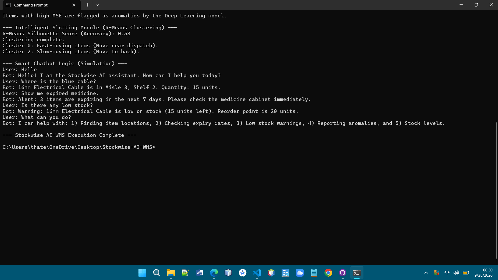
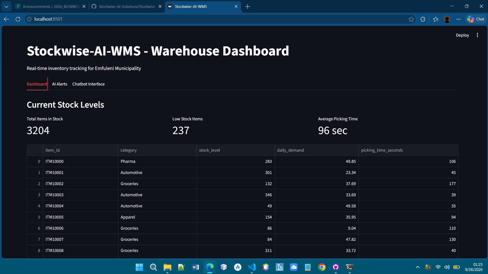
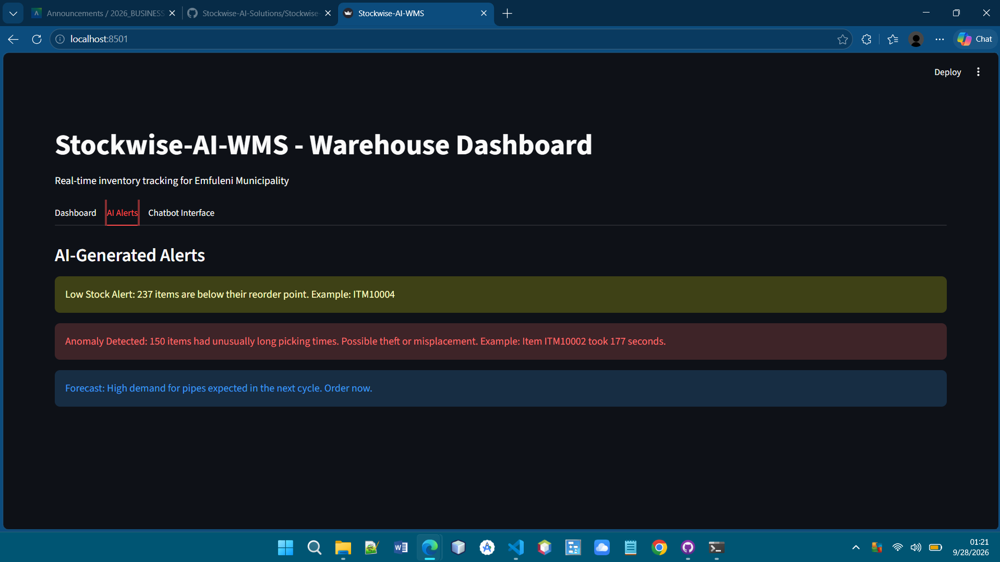
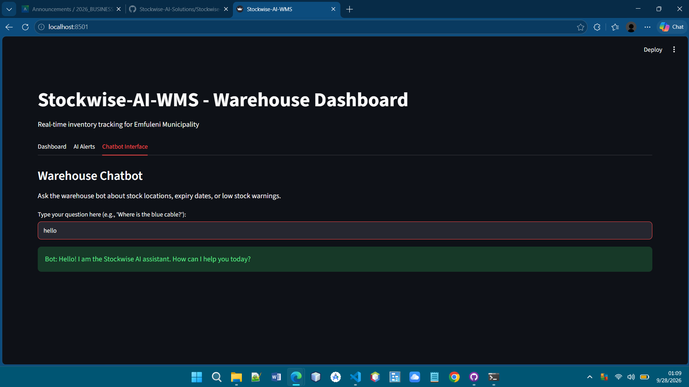
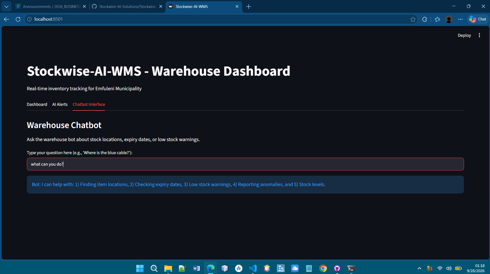
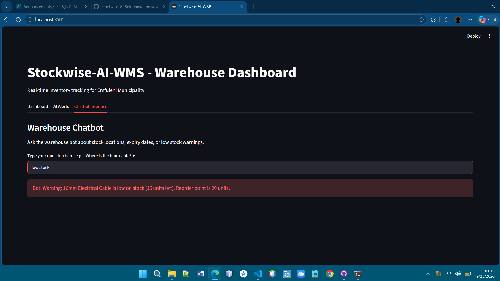

# Stockwise-AI-WMS

**Module:** Business Analysis 3.2 Capstone (AI Solution for Industries)
**Project:** Intelligent Warehouse Management System for Emfuleni Municipality

## What is this project?
We built Stockwise-AI-WMS for our Business Analysis 3.2 project. The theme was "AI Solution for Industries," and we chose to focus on warehouses. 

During a site visit to a municipal warehouse in Vereeniging, we saw that staff were still using paper logbooks and clipboards to track stock. This makes it hard to know what is in the warehouse, leads to theft, and causes long delays. Our system uses machine learning to solve these problems. It predicts what stock is needed, spots suspicious activity, organises the warehouse layout, and answers staff questions through a chatbot.

## What does the system do?
1. **Demand Forecasting:** Uses Time Series Analysis (Linear Regression) to predict future stock needs.
2. **Theft Detection:** Uses Isolation Forest and a Deep Learning model (MLP) to find unusual picking times.
3. **Smart Slotting:** Uses K-Means Clustering to group fast-moving items near the dispatch area.
4. **Chatbot:** A simple Natural Language Processing bot that answers staff questions about stock.

## Screenshots of the System

### Terminal Output

Figure 1: The Python script running in the terminal. It shows the demand forecast, anomaly detection and clustering results.

### Dashboard Interface

Figure 2: The main dashboard of our system. It gives an overview of the current stock levels and key warehouse metrics.

### AI Alerts

Figure 3: The AI alerts tab. It warns us about low stock items and unusual activity.

### Chatbot Interface (Greeting)

Figure 4: The chatbot responding to a simple greeting from a staff member.

### Chatbot Interface (Features)

Figure 5: The chatbot explaining the different things it can help with.

### Chatbot Interface (Low Stock)

Figure 6: The chatbot responding to a staff question about low stock items.

### Chatbot Interface (Theft Detection)

Figure 7: The chatbot giving an alert about recent anomalies and possible theft detected by the system.
