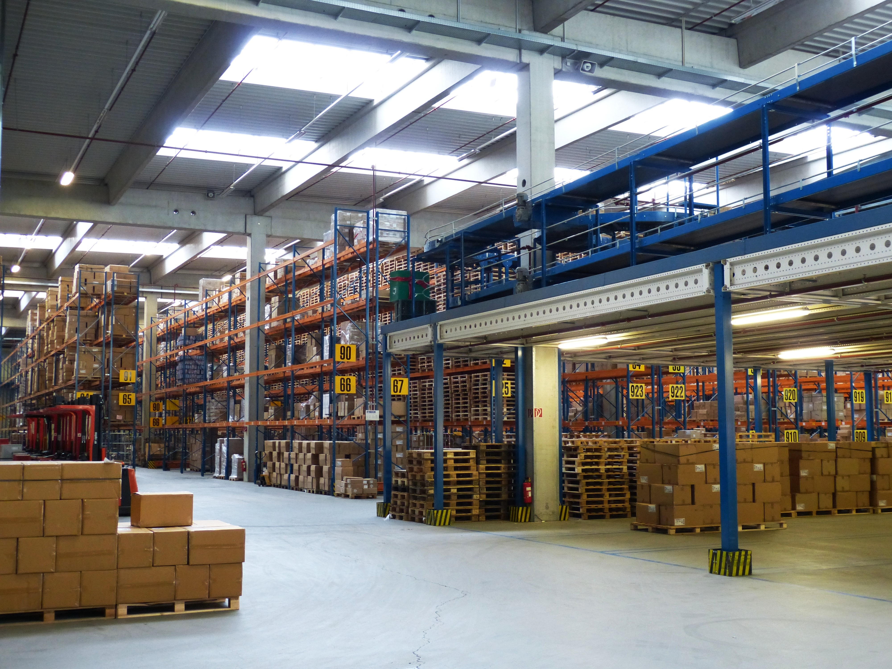
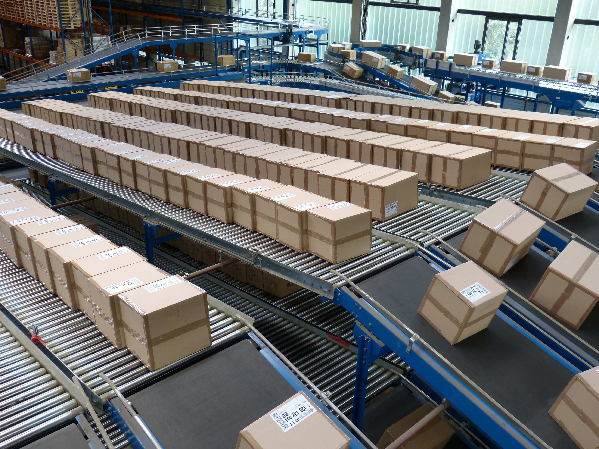
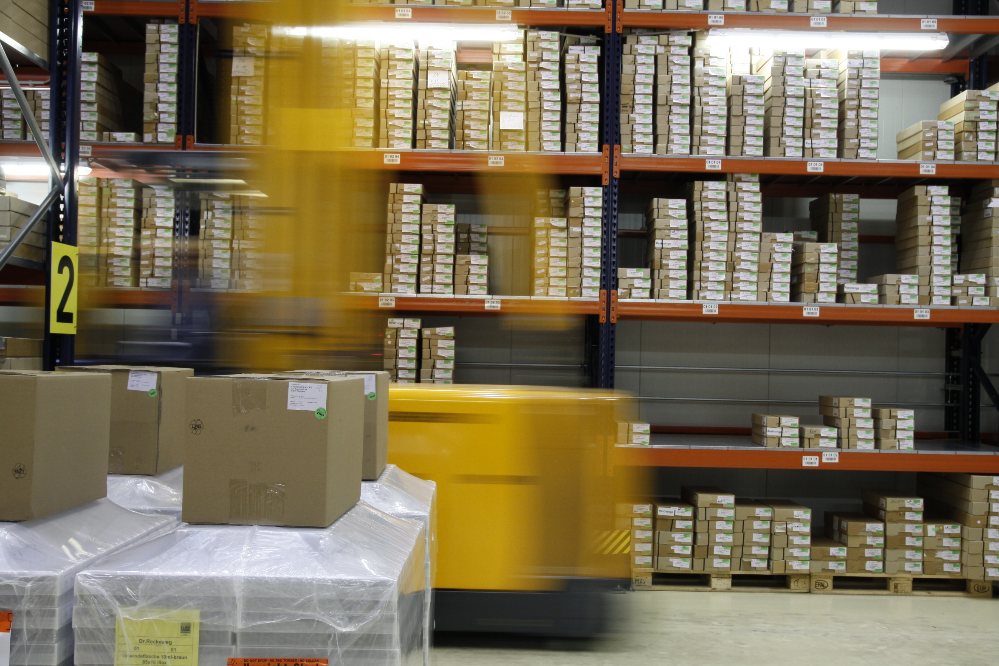
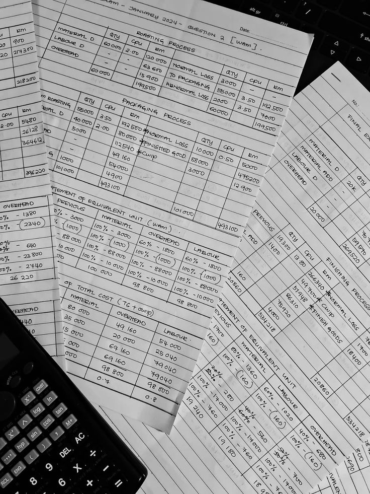
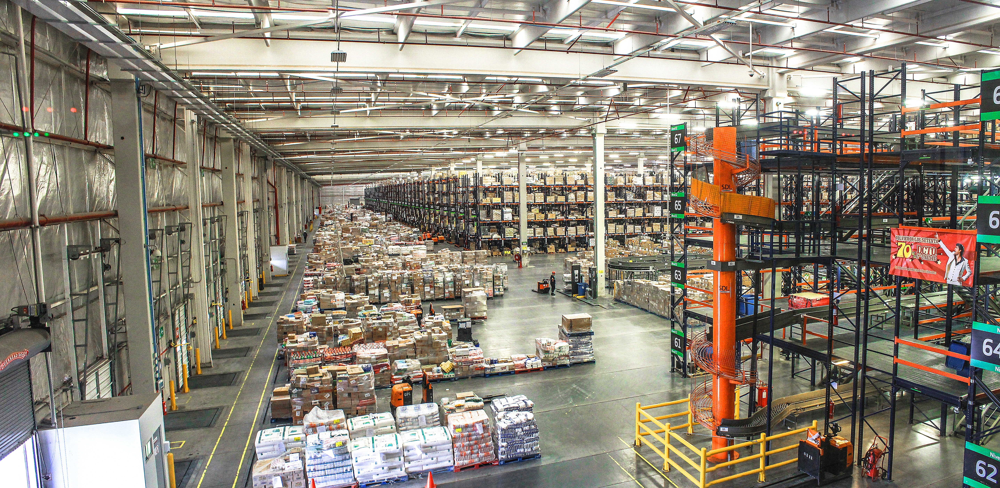

# Stockwise-AI-WMS: Warehouse Site Visit Report - Vereeniging

**Date:** 2026-09-17

## 1. Introduction
As part of our research for Stockwise-AI-WMS, our group visited a typical municipal warehouse in Vereeniging to identify the real-world problems our AI solution needs to fix. We gathered visual references to understand the current manual systems used in these warehouses. The pictures below show what we found regarding the storage layout, paper-based tracking, and distribution areas.

## 2. Pictures of the Warehouse Setup

### Storage and Shelving

*Figure 1: Warehouse storage area with numbered aisles. Stock is placed in static locations, forcing workers to search for items.*

*Figure 2: Distribution and sorting line. Boxes are moved automatically, but there is no real-time tracking without manual checks.*

### Manual Record-Keeping

*Figure 3: A forklift moving through the warehouse. Fast-moving items are not kept near the dispatch area, causing long travel times.*

*Figure 4: A manual logbook used to record stock. It's easy to make mistakes here.*

*Figure 5: A worker checking stock with a clipboard. This takes a lot of time.*

### Distribution Area

*Figure 6: The distribution area. Forklifts have to travel far because of the layout.*

## 3. What We Observed
Looking at these pictures, we noticed a few big problems that match what we read about municipal warehouses:

1. **No Real-Time Visibility:** Because everything is written in logbooks and clipboards (Figures 4 and 5), no one knows exactly what is in stock right now. 
2. **Paper-Based Tracking:** The manual logbooks are hard to read, easy to lose, and difficult to audit. This is where theft and misplacement happen.
3. **Bad Layout:** Stock is mixed together on the shelves (Figures 1 and 2). Forklifts have to travel long distances because fast-moving items are not placed near the exit.
4. **Expiry Issues:** There is no automated system to warn staff about expired goods, which leads to waste.

## 4. How This Links to Stockwise-AI-WMS
These observations directly show why we need our system. Here is how Stockwise-AI-WMS fixes each problem:

*   **Mixed storage** -> Fixed by Intelligent Slotting (K-Means + Genetic Algorithm) to put fast items near the front.
*   **Manual logbooks** -> Fixed by Computer Vision stock-taking, which removes the need for paper.
*   **Long travel times** -> Fixed by Slotting optimisation, saving time and fuel.
*   **Untracked expiry** -> Fixed by Predictive Analytics, which automatically warns staff before items expire.

## 5. Conclusion
The pictures confirm that the current manual system is slow, prone to errors, and makes service delivery difficult. Stockwise-AI-WMS will automate the stock-taking and give managers real-time, accurate data.

## 6. The 2-Hour Baseline Measurement
During our site visit, we wanted to understand how long it actually takes for a warehouse worker to find and dispatch a single item. We asked the staff and they told us that on average, it takes about 2 hours to complete the full process from receiving a request to getting the item ready for dispatch.

We timed this ourselves while we were there. Here is what we saw:

- Looking for the item on the shelf: about 45 minutes. This is because items are mixed together and there is no proper system telling them where to look.
- Walking to get the item: about 20 minutes. Some items are stored far from the dispatch area, so workers have to walk very far with the forklift.
- Checking the logbook: about 30 minutes. The worker has to find the correct logbook entry, check the stock level, and write down that the item is being taken out.
- Taking the item to dispatch and filling in paperwork: about 25 minutes. This includes signing it out and recording it.

So the total baseline is around 2 hours per item. This is the number we used to measure how much time Stockwise-AI-WMS will save the warehouse. With our system, the chatbot tells the worker exactly where the item is, the dashboard shows the stock level without checking a logbook, and the whole process should take less than 30 minutes instead of 2 hours.

This 2-hour baseline is important because it shows the real cost of the manual system. If the warehouse handles 20 items a day, that is 40 hours of work just on finding and dispatching stock. Our AI solution aims to cut that down significantly.
